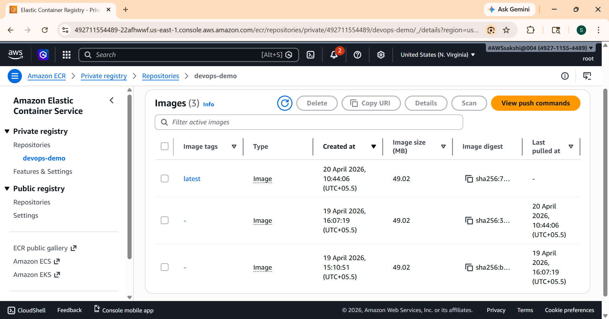
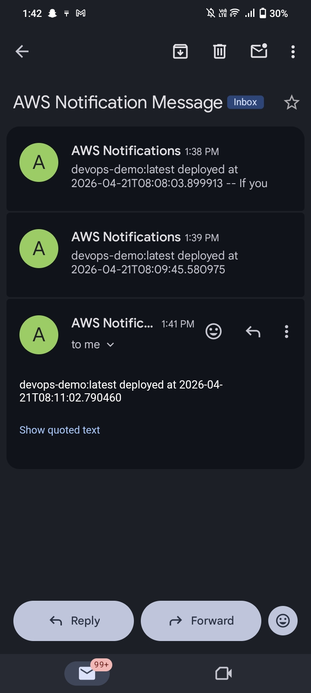

# Automated Docker Image Deployment to Amazon ECR with Jenkins and Lambda Integration

## Project Overview
This project demonstrates a complete CI/CD pipeline for containerized applications using Docker, Jenkins, and AWS services. The pipeline automatically builds a Docker image, pushes it to Amazon ECR, and triggers an AWS Lambda function to perform post-deployment tasks such as logging metadata to DynamoDB and sending SNS notifications.

The goal of this project is to understand DevOps automation, container registry management, and event-driven serverless workflows on AWS.

---

## Architecture Diagram
```
Developer → GitHub → Jenkins (EC2) → Docker Build → Amazon ECR → EventBridge → AWS Lambda → DynamoDB + SNS
```
---
## Pipeline Flow

- Developer pushes application code to GitHub
- Jenkins pipeline is triggered automatically
- Jenkins pulls the latest code from GitHub
- Jenkins builds the Docker image using Dockerfile
- The image is tagged with a build number
- Jenkins authenticates with Amazon ECR
 - The Docker image is pushed to ECR
- Amazon EventBridge detects the image push event
- EventBridge triggers an AWS Lambda function
- Lambda logs the image metadata to DynamoDB
- SNS notification is sent for deployment 

--- 
## Technologies Used
- Docker - Containerization
- Jenkins - CI/CD Pipeline
- Amazon EC2 - Jenkins Server
- Amazon ECR - Container Registry
- AWS Lambda - Serverless Processing
- Amazon EventBridge - Event Management
- Amazon DynamoDB - Metadata Storage
- Amazon SNS - Notifications
- GitHub - Source Code Management
- Python Flask - Sample Application

## Project Structure
```
docker-ecr-jenkins-lambda/
│
├── app.py
│   
│
├── Dockerfile
│
├── Jenkinsfile
│
├── lambda_function.py
│    
└── README.md
```
---
### Step 1: Launch Jenkins Server (EC2)
---
#### Instance Configuration
- Name: Jenkins Server
- AMI: Ubuntu 
- Instance Type: t2.micro

**Security Group Ports:**
- Port 22: SSH
- Port 8080: Jenkins
- Port 5000: Flask App

**Connect to Instance**
```
ssh -i key.pem ubuntu@EC2_PUBLIC_IP
```
---
### Step 2: Install Jenkins
---
Update System
```
sudo apt update
```
Install Java
```
sudo apt install openjdk-17-jdk -y
```

Install Jenkins
```
curl -fsSL https://pkg.jenkins.io/debian/jenkins.io-2023.key | sudo tee /usr/share/keyrings/jenkins-keyring.asc > /dev/null

```

```
echo deb [signed-by=/usr/share/keyrings/jenkins-keyring.asc] https://pkg.jenkins.io/debian binary/ | sudo tee /etc/apt/sources.list.d/jenkins.list > /dev/null
```

```
sudo apt update
sudo apt install jenkins -y
```
Start Jenkins
```
sudo systemctl start jenkins
sudo systemctl enable jenkins
```
Access Jenkins
```
 http://EC2_PUBLIC_IP:8080
```
Get initial password:
```
sudo cat /var/lib/jenkins/secrets/initialAdminPassword
```
---
### Step 3: Install Docker
---
```
sudo apt install docker.io -y
sudo systemctl start docker
sudo systemctl enable docker
sudo usermod -aG docker jenkins
sudo systemctl restart jenkins
```
---
### Step 4: Install AWS CLI
---
```
sudo apt install awscli -y
aws --version
aws configure
```
---
### Step 5: Create Amazon ECR Repository
---
```
aws ecr create-repository --repository-name devops-demo --region us-east-1
```
Repository URI Example:
```
492711554489.dkr.ecr.us-east-1.amazonaws.com/devops-demo
```
---
### Step 6 :Lambda
---
**Triggered after image push**
```
image_tag
timestamp
repository
```
---
### Stap 7: DynamoDB
---
- Table: ecr-deployments123
- Partition key: timestamp
- Sort key: repositery
---
### Stap 8 : Amazon SNS
---
- SNS is used to send notifications after Lambda execution.
---
## IMAGES
### Jenkins Pipeline Success
---

---
### Docker Image Build
---

---
### ECR Image
---

---
### Application Running
---
 **EC2_PUBLIC_IP:5000**

---
### SNS notifications
---

